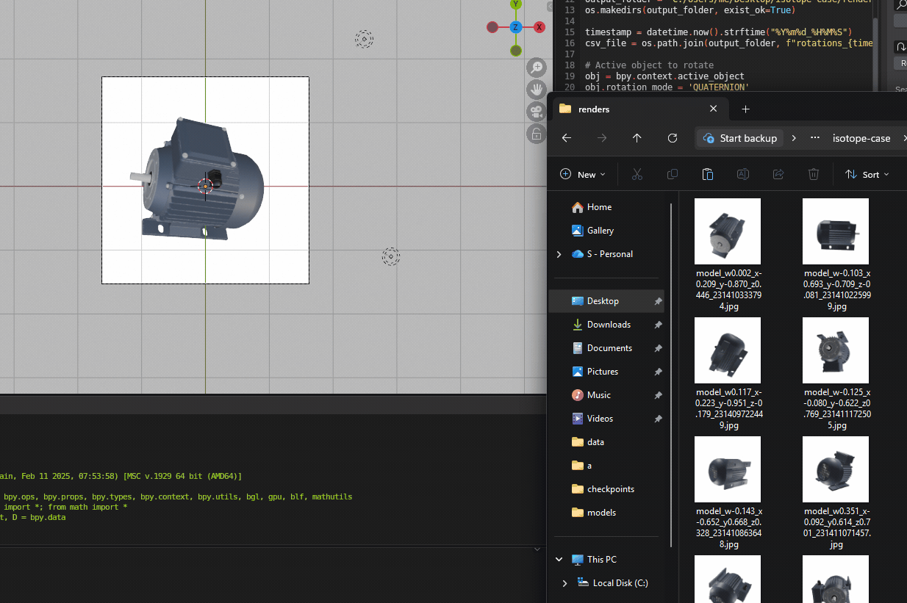
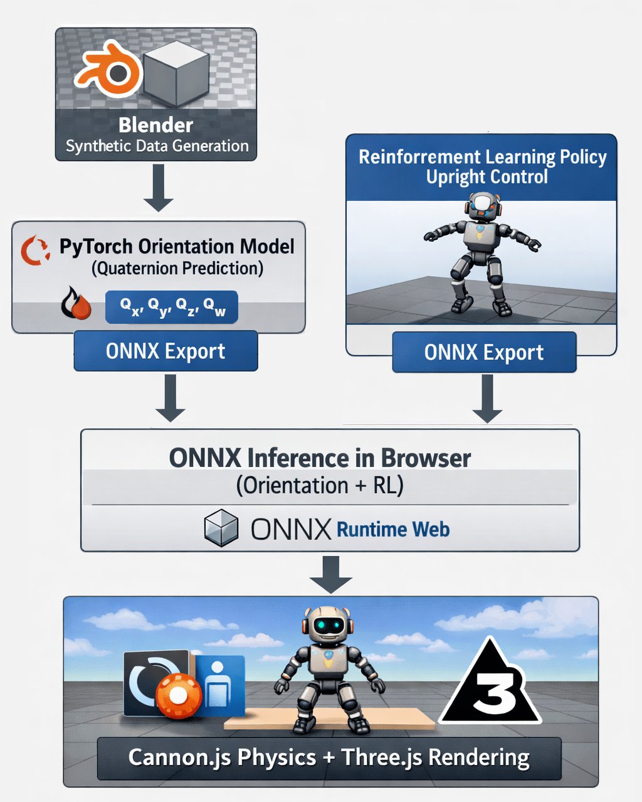

# 🧠 Client-Side Reinforcement Learning for 3D Orientation Control

**End-to-end ML + RL + 3D physics system running entirely in the browser.**  
This project generates synthetic data, trains deep learning and reinforcement learning models, converts them to ONNX, and deploys everything to a **fully client-side WebGPU/WebGL simulation** — no backend required at inference time.

---

## 🎥 Live Project Previews (In-Browser)

### 🔄 Reinforcement Learning Re-Orientation

<p align="center">
  <em>
    A trained RL policy actively re-orients the 3D engine model upright in real time.
    Actions are based on predicted quaternions from the orientation model.
  </em>
</p>

<p align="center">
  
</p>

---

### 🧠 Orientation Prediction Model

<p align="center">
  <em>
    Left: live rendered object · Right: neural network predicted quaternions
  </em>
</p>

<p align="center">
  
</p>

---

### 🧪 Synthetic Dataset Generation

<p align="center">
  <em>
    Synthetic dataset generated in Blender with randomized SO(3) rotations
    and ground-truth quaternion labels.
  </em>
</p>

<p align="center">
  
</p>

---

## 🚀 Project Summary

This project demonstrates a **full ML lifecycle** — from data generation to deployment — applied to a real-time 3D control problem.

**High-level pipeline:**

1. Generate a **synthetic image dataset** using Blender and Python scripting
2. Train a **deep learning model** to predict 3D orientation (quaternions)
3. Train a **reinforcement learning policy** to re-orient the object upright
4. Export trained models to **ONNX**
5. Run **real-time ML inference + physics simulation entirely in the browser**

Everything runs locally in JavaScript using WebGPU/WebGL, ONNX Runtime Web, and a physics engine.

---

## 🧩 System Architecture

<p align="center">
  
</p>


---

## 🧪 1. Synthetic Dataset Generation

To avoid real-world data collection, I created a **fully synthetic dataset**:

- Built a **Blender scene** with a 3D engine model
- Used **Blender Python scripting** to:
  - Randomly rotate the object across SO(3)
  - Render images from a fixed camera
  - Record **ground-truth orientation as quaternions**
- Exported image + quaternion pairs for training

This approach enables:
- Perfect labels
- Unlimited data
- Full control over distribution and augmentation

---

## 🧠 2. Orientation Prediction Model

I trained a neural network to **predict the object’s orientation directly from images**.

**Details:**
- Framework: **PyTorch**
- Input: rendered RGB images
- Output: object orientation (quaternion)
- Loss: rotation-aware loss (normalized quaternion regression)
- Training performed on an **external GPU server**

### Remote Training & Deployment
- Connected to a GPU server via **SSH**
- Training pipeline automated
- After training completion:
  - Model artifacts automatically deployed to an **NGINX directory**
  - Pulled directly into the web application

This simulates a lightweight **CI/CD workflow for ML models**.

---

## 🎮 3. Reinforcement Learning Policy

I trained a **reinforcement learning agent** to actively re-orient the object upright.

**RL setup:**
- Environment: physics-based 3D orientation task
- Observation: Noisy orientation (to generalize for loss in predicted quaternions in final product) + physics state
- Action space: rotational torque
- Objective: minimize angular error from upright pose

**Result:**
- The policy learns to flip and stabilize the object in real time given noisy XYZW quaternions
- Policy generalizes across initial, randomized orientations

---

## 🌐 4. Fully Client-Side Web Simulation

The final system runs **entirely in the browser**.

### Browser Stack
- **Three.js** — 3D rendering
- **Cannon.js** — physics simulation
- **ONNX Runtime Web** — ML inference
- **WebGPU / WebGL** — GPU-accelerated rendering

### Runtime Loop
1. Render camera view of the object
2. Run orientation prediction (ONNX)
3. Feed prediction into RL policy (ONNX)
4. Apply torque to physics body
5. Step physics simulation
6. Sync physics → renderer
7. Repeat at ~60 FPS

No Python. No server. No network latency.

---

## 📁 Project Structure

```
main-prediction-RL/
├── index.html # Client-side application
├── img/ # Project GIFs (previews)
│ ├── final-orientation.gif
│ ├── predictions.gif
│ └── synthetic.gif
├── static/
│ ├── css/
│ ├── js/
│ │ ├── physics.js # Cannon.js simulation
│ │ ├── inference.js # ONNX inference
│ │ ├── simulation.js # Main loop
│ │ └── vis_torque.js # Draw RL actions onto model
│ └── models/
│ ├── pose_model.onnx # Model to predict quarternions from an image
│ ├── engine.glb # 3D Engine model
│ └── rl_policy.onnx # Reinforced learning policy for orientating our object
└── backend/
├── server.py # Backend to serve files
```


---

## 🛠️ Full Technology Stack

### Machine Learning
- PyTorch
- ONNX / ONNX Runtime
- Reinforcement Learning (policy optimization)
- Quaternion math & rotation representations

### 3D & Simulation
- Blender (data generation + scripting)
- Three.js
- Cannon.js (physics)
- WebGPU / WebGL

### Infrastructure & DevOps
- Remote GPU training via SSH
- Automated model export & deployment
- NGINX static hosting
- Fully static cloud deployment (Cloudflare Pages)

---

## 💼 Skills Demonstrated

- Synthetic data generation for computer vision
- Deep learning model training & evaluation
- Reinforcement learning for continuous control
- Physics-based simulation
- Model optimization & ONNX deployment
- Browser-based ML inference
- 3D graphics & real-time rendering
- Full ML lifecycle ownership (data → model → deployment)
- Production-style ML workflows

---

## 📌 Why This Project Matters

This project shows the ability to:
- Build **ML systems, not just models**
- Work across **ML, RL, 3D, web, and infrastructure**
- Deploy performant ML **outside Python**
- Design systems suitable for **real-time, interactive environments**

